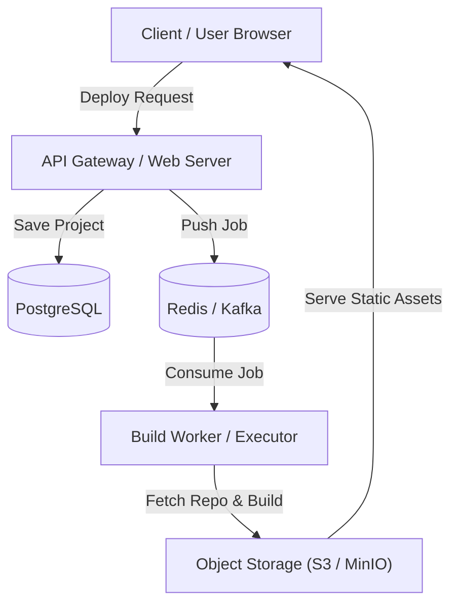
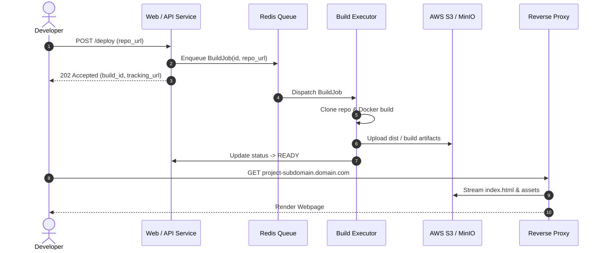
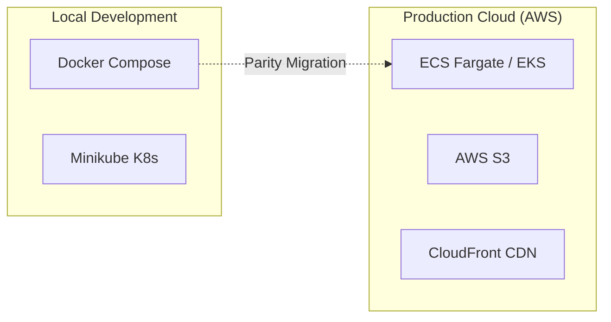

# System Architecture & Evolution: {{PROJECT_NAME}}

*Last Updated: {{DATE}}*

---

## 1. High-Level System Overview
{{HIGH_LEVEL_DESCRIPTION}}

---

## 2. Component Topology & Responsibility Matrix

| Component | Tech Stack | Role / Responsibility | Key Ports / Protocols |
| :--- | :--- | :--- | :--- |
| `{{COMPONENT_1}}` | {{STACK_1}} | {{ROLE_1}} | {{PORTS_1}} |
| `{{COMPONENT_2}}` | {{STACK_2}} | {{ROLE_2}} | {{PORTS_2}} |
| `{{COMPONENT_3}}` | {{STACK_3}} | {{ROLE_3}} | {{PORTS_3}} |

---

## 3. Data Flow & Execution Sequence

---

## 4. Infrastructure & Deployment Matrix

---

## 5. Architectural Evolutions (Twists & Turns Log)

| Date | Phase | Architecture Before | Shift / Pivot Made | Trigger / Problem Encountered | Relevant ADR |
| :--- | :--- | :--- | :--- | :--- | :--- |
| {{DATE_1}} | {{PHASE_1}} | {{BEFORE_1}} | {{SHIFT_1}} | {{TRIGGER_1}} | [ADR-001](../adr/001-sample.md) |
