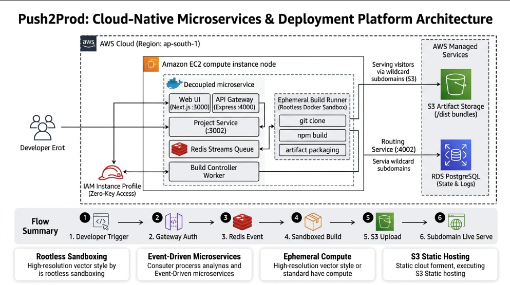
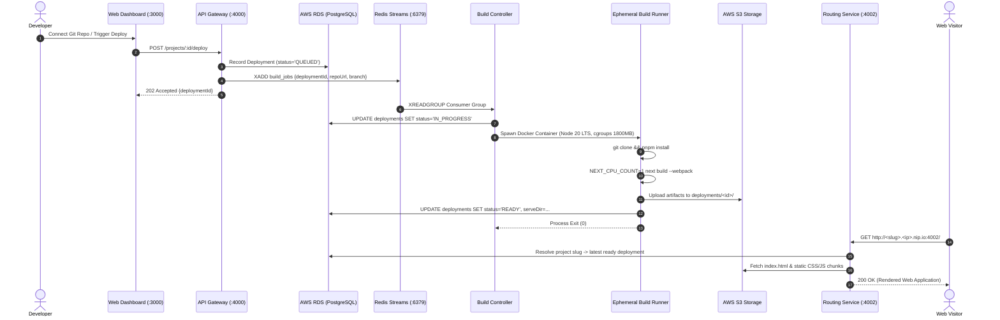

<div align="center">

# 🚀 Push2Prod 

**A Cloud-Native, Self-Hosted Frontend Deployment & Static Hosting Platform**  
*Achieving 100% Vercel Feature Parity on AWS Free-Tier Infrastructure ($0/month)*

[](https://nodejs.org)
[](https://www.typescriptlang.org)
[](https://nextjs.org)
[](https://www.docker.com)
[](https://aws.amazon.com)
[](https://redis.io)
[](https://www.prisma.io)
[](LICENSE)

---

</div>

## 📌 Architecture Overview

Push2Prod is an open-source Platform-as-a-Service (PaaS) that replicates commercial frontend deployment platforms (like Vercel and Netlify). It allows developers to connect Git repositories, trigger builds inside ephemeral sandboxed runners, upload compiled bundles to AWS S3, and serve multi-tenant websites through an isolated reverse proxy.

<div align="center">
  
</div>

---

## ✨ Key Features & Capabilities

- ⚡ **Zero-Configuration Git Deployments:** Automatic framework detection for Next.js (App & Pages Router), Vite, React (CRA), Astro, and static HTML sites.
- 🌐 **Virtual Host Subdomain Isolation:** Dynamic wildcard subdomain routing (`http://<slug>.<ip>.nip.io:4002/`) providing root-level namespace isolation matching Vercel (`*.vercel.app`).
- 🛡️ **Sandboxed Ephemeral Execution:** Isolated build runner containers with strict cgroup limits (`--memory 1800m`), concurrency clamping (`NEXT_CPU_COUNT=1`), and swap-backed V8 heap expansion (`NODE_OPTIONS="--max-old-space-size=1536"`).
- 🔗 **Referer Fallback Asset Rewriting:** Automatic recovery of root-relative asset URLs (`/_next/static/css/...`, `/assets/...`) for legacy raw path visits without breaking styles.
- 🗄️ **Automated S3 Storage Purging:** Cascading deletion wipes all build artifacts from AWS S3 upon project or deployment deletion, keeping S3 storage at $0 within the AWS Free Tier.
- 📡 **Event-Driven Microservices:** Asynchronous build coordination powered by Redis Streams consumer groups, decoupled from the web control plane.
- 📊 **Real-Time Logs & Diagnostics:** Merged `stdout`/`stderr` logging with automated Linux Out-Of-Memory (OOM Killer Exit 137 / `SIGKILL`) detection.

---

## 🏗️ System Architecture & Data Flow



---

## 🧩 Microservices Matrix

| Microservice | Port | Stack | Role & Responsibility |
| :--- | :--- | :--- | :--- |
| **`apps/web`** | `3000` | Next.js 14, Tailwind, NextAuth | Developer dashboard, GitHub repo selector, live deploy logs |
| **`apps/api-gateway`** | `4000` | Express, TypeScript, Prisma | Unified ingress, session validation, route forwarding |
| **`services/project-service`** | `3002` | Express, Prisma, AWS SDK | Project CRUD, environment variables, deployment state machine, S3 cleanup |
| **`services/build-controller`** | Worker | Node.js, Redis Streams, Docker | Consumes build queue, enforces cgroups, launches isolated runners |
| **`services/build-runner`** | Ephemeral | Alpine, Node.js 20 LTS, Git | Clones repos, installs deps, executes builds, pushes to S3 |
| **`services/routing-service`** | `4002` | Express, AWS S3 Client, Redis | Reverse proxy mapping wildcard subdomains to S3 objects with auto-MIME |
| **`redis`** | `6379` | Redis 7 Alpine | Event bus, job queues (Streams), routing cache (TTL 60s) |

---

## ⚡ Vercel Parity on AWS Free Tier: How I Did It

Running multi-framework repositories (Next.js 16, Vite, Tailwind) on an **AWS EC2 `t3.micro` (1 GB RAM, 2 vCPUs)** requires overcoming severe resource constraints:

| Architectural Challenge | Commercial Vercel Platform | Push2Prod Free Tier Engineering |
| :--- | :--- | :--- |
| **Execution Memory** | 8 GB–16 GB dedicated MicroVMs | 1 GB physical RAM + 4 GB swap + `--memory 1800m` cgroup limit |
| **Compiler Concurrency** | Turbopack parallel workers (4–8 vCPUs) | Single-worker sequential mode (`NEXT_CPU_COUNT=1`) via Webpack |
| **V8 Heap Ceiling** | Dynamic unconstrained allocation | Explicit override (`--max-old-space-size=1536`) utilizing swap |
| **Namespace Isolation** | Dedicated subdomains (`*.vercel.app`) | Wildcard DNS subdomains (`<slug>.<ip>.nip.io:4002`) |
| **Asset Fallbacks** | Subdomain-only routing | HTTP `Referer` header inspection middleware |
| **Runtime Base** | Node.js 20 LTS standard environment | Base image pinned to `node:20-alpine` (Node 20 LTS) |
| **Monthly Cost** | $20+/month per user | **$0.00 / month** (100% AWS Free Tier eligible) |

---

## 🚀 Quickstart & Local Development

### 1. Prerequisites
- [Docker & Docker Compose](https://www.docker.com/)
- [Node.js 20 LTS](https://nodejs.org/) & [pnpm](https://pnpm.io/) (`corepack enable pnpm`)

### 2. Clone and Install
```bash
git clone https://github.com/AkshitBhandariCodes/Push2Prod.git
cd Push2Prod
pnpm install
```

### 3. Configure Environment Variables
Copy `.env.example` to `.env`:
```bash
cp .env.example .env
```
Ensure your GitHub OAuth App credentials (`AUTH_GITHUB_ID` & `AUTH_GITHUB_SECRET`) are filled in.

### 4. Run Locally (Docker Compose with MinIO S3 Backend)
```bash
docker compose up -d
```
The platform will be live at:
- **Web Dashboard:** [http://localhost:3000](http://localhost:3000)
- **API Gateway:** [http://localhost:4000](http://localhost:4000)
- **Routing Service:** [http://localhost:4002](http://localhost:4002)
- **MinIO S3 Console:** [http://localhost:9001](http://localhost:9001)

---

## ☁️ Production Deployment on AWS

1. **Deploy CloudFormation Infrastructure:**
   ```bash
   aws cloudformation deploy \
     --template-file infra/template.yaml \
     --stack-name push2prod-prod \
     --capabilities CAPABILITY_IAM
   ```
2. **Start Production Services on EC2:**
   ```bash
   docker compose -f docker-compose.prod.yml up -d --build
   ```
3. **Access Your Live Sites:**
   - **Preview Link:** `http://<project-slug>.<ec2-public-ip>.nip.io:4002/`

---

## 🛡️ License

Distributed under the **MIT License**. See `LICENSE` for more information.

---

<div align="center">
  <b>Built with ❤️ by <a href="https://github.com/AkshitBhandariCodes">Akshit Bhandari</a></b>
</div>
