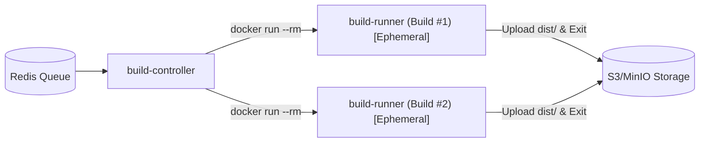

# ADR-001: Dynamic Ephemeral Build Runners vs Long-Running Worker Pool

- **Status:** Accepted
- **Date:** 2026-08-26
- **Deciders:** Akshit Bhandari
- **Related Commits:** [`d2b560b`](https://github.com/AkshitBhandariCodes/Vercel-pro/commit/d2b560bb76da0d2c93017ad2f68b368314d3e9e6)
- **Related Journey Entry:** [Phase 1: Docker in Docker with AWS](../journey/2026-08-26-phase-1-docker-in-docker-aws.md)

---

## Context and Problem Statement
When building a multi-tenant CI/CD and deployment engine (like Vercel), untrusted user code (dependencies, custom build scripts, `postinstall` hooks) must be executed to compile frontend applications (`npm run build`).

We needed to decide how to run these builds securely and reliably:
1. Should we have long-running background worker containers that pull and run builds in the same operating environment?
2. Or should we dynamically spin up a clean, isolated container or pod for each individual build job?

---

## Decision Drivers
- **Tenant Isolation & Security:** Malicious build scripts must not access another project's code, credentials, or filesystem.
- **Resource Cleanup:** Build environments can accumulate heavy `node_modules` caches or zombie processes.
- **Scalability:** System must scale down to zero when idle and burst when multiple deployments arrive.

---

## Considered Options
1. **Option 1: Long-running worker pool.** Static workers listening to Redis, executing `npm run build` in local worker folders.
2. **Option 2: Ephemeral Docker / DinD containers launched per build.** `build-controller` calls Docker API / K8s API to launch single-use containers that terminate upon exit.
3. **Option 3: Firecracker MicroVMs.** Complete virtual machine isolation per build.

---

## Decision Outcome
**Chosen Option:** `Option 2: Ephemeral Docker / DinD containers launched per build`.

### Rationale
- Each build receives a pristine filesystem and isolated environment.
- Any leftover files, killed processes, or compromised dependencies vanish once the container exits.
- Simple transition to Kubernetes Pods (e.g. `k8s-executor.ts` using Kubernetes Jobs/Pods).
- Avoids the complex kernel and hypervisor requirements of Option 3 while solving the fatal security flaws of Option 1.

### Trade-offs & Mitigations
- **Trade-off:** Cold-start latency of spinning up a container per job (~1-3 seconds).
- **Mitigation:** Pre-pull base `build-runner` images and mount persistent build cache volumes when required.
