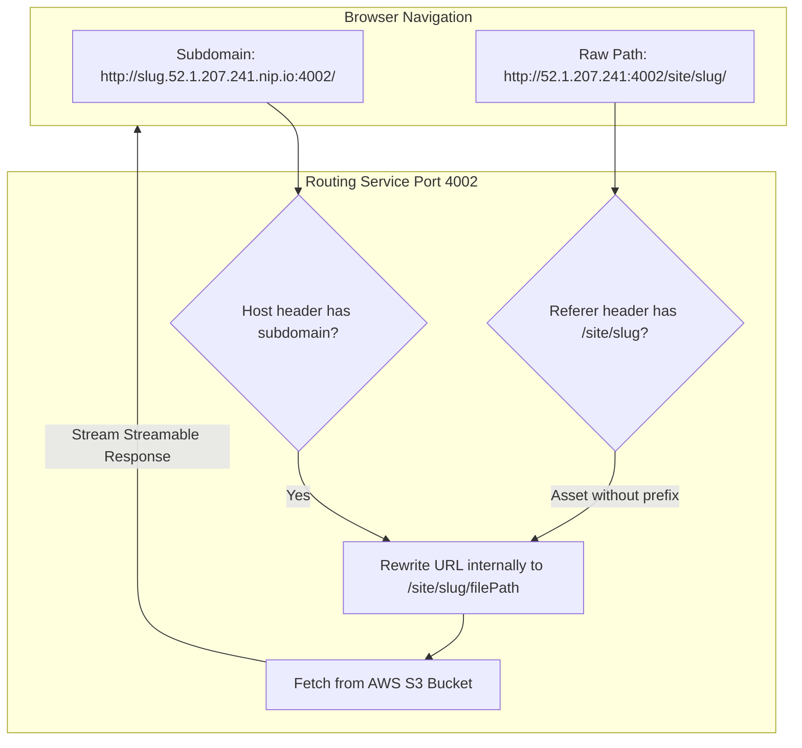

# ADR-003: Vercel Parity — Subdomain Asset Isolation, Node 20 LTS Alignment & Low-Memory Build Orchestration

- **Date:** 2026-10-03
- **Status:** Accepted
- **Author:** AkshitBhandariCodes
- **Impacted Services:** `services/routing-service`, `services/build-runner`, `services/build-controller`, `apps/web`

---

## 1. Context & Problem Statement

Push2Prod aims to provide an open-source, self-hosted deployment experience functionally equivalent to commercial platforms like Vercel. However, running real-world frontend repositories (such as Next.js 16 and Vite/Tailwind applications) on an AWS EC2 Free Tier instance (`t3.micro` with 1 GB RAM) exposed three architectural disparities with commercial PaaS:

1. **Broken Asset Loading on Subdirectory Paths:**
   When user deployments were accessed via path-based URLs (`http://<ip>:4002/site/<slug>/`), HTML rendered unstyled with broken images. Next.js and Vite bundle assets with root-relative paths (`/_next/static/css/...`, `/assets/...`). Browsers requested these assets from the root domain (`http://<ip>:4002/_next/...`), discarding the `/site/<slug>/` prefix and returning 404s.
   *Vercel Contrast:* Vercel **never** serves user projects from subdirectories; it assigns every deployment an isolated root subdomain (`https://<project>.vercel.app/`).

2. **Linux OOM Killer & Multi-Threaded Turbopack Compilers:**
   Next.js 16 defaults to Turbopack (`▲ Next.js 16.3.3 (Turbopack)`), a Rust-based parallel compilation engine that spawns worker threads across all detected CPU cores, demanding 4 GB–8 GB of RAM. On a 1 GB `t3.micro` sharing memory with 6 backend containers, Turbopack and V8's default 450MB heap ceiling triggered kernel `SIGKILL` / Exit code 137 (`Out of Memory`).
   *Vercel Contrast:* Vercel runs builds in dedicated, ephemeral AWS Lambda/Firecracker microVMs with **8 GB to 16 GB of dedicated RAM**.

3. **Runtime Incompatibilities in Bleeding-Edge Node Versions:**
   `build-runner` initially used `node:22-alpine`. Node 22 introduced stricter ECMAScript module (ESM) scoping rules, causing PostCSS and Tailwind to crash with `ParseError: Identifier 'createRequire' has already been declared`.
   *Vercel Contrast:* Vercel standardizes all production build environments on **Node.js 20 LTS**.

---

## 2. Decision Drivers

- **Zero-Cost Constraint:** The system must run reliably within the AWS Free Tier (`t3.micro`, 1 GB RAM, no paid resources).
- **Zero Configuration for Users:** Developers should deploy standard Next.js, Vite, and Astro apps without having to manually modify their `basePath` or asset configurations.
- **Architectural Parity:** Emulate Vercel's root subdomain routing model without forcing users to purchase custom wildcard domain certificates.

---

## 3. Considered Options

### For Asset Routing:
- **Option A (Rejected): Force users to set `basePath` in `next.config.js`.**
  - *Cons:* Violates the zero-configuration principle; repos hosted on Vercel/GitHub would break when imported into Push2Prod.
- **Option B (Accepted): Hybrid Subdomain Isolation (`nip.io`) + HTTP Referer Fallback.**
  - *Pros:* Generates root subdomains (`http://<slug>.<ip>.nip.io:4002/`) using free public wildcard DNS. Adds an Express middleware fallback that checks `req.headers.referer` for raw path visits.

### For Low-Memory Build Execution:
- **Option A (Rejected): Require upgrading to `t3.medium` (4 GB RAM).**
  - *Cons:* Incurs monthly AWS costs, breaking the Free Tier goal.
- **Option B (Accepted): Sequential Worker Compilation + Explicit V8 Heap Expansion.**
  - Set `NEXT_CPU_COUNT=1` to enforce single-worker sequential compilation (halving RAM consumption).
  - Use `next build --webpack` for low-memory efficiency (~500MB vs ~4GB Turbopack).
  - Explicitly inject `NODE_OPTIONS="--max-old-space-size=1536"` in `build-runner` to prevent V8 from clamping heap size to 450MB.
  - Back the container with an active 4GB swap space and a 1,800MB cgroup limit.

### For Build Runtime:
- **Option A (Accepted): Downgrade Build Runner to Node.js 20 LTS (`node:20-alpine`).**
  - Matches Vercel's default environment and eliminates Node 22 ESM/PostCSS AST collisions.

---

## 4. Decision Outcome & Architecture

### Key Changes Implemented:

1. **Routing Service (`services/routing-service/src/index.ts`):**
   - Wildcard hostname parser: extracts `slug` from `<slug>.<ip>.nip.io:4002` and maps root requests `/` to `/site/<slug>/`.
   - Referer asset rewrite: when an un-prefixed asset (`/_next/static/css/...`) is requested on a raw IP, matches `req.headers.referer` to automatically restore the target deployment.
   - Trailing slash normalization: redirects `/site/:slug` -> `/site/:slug/` only when the trailing slash is missing in `req.originalUrl`, preventing infinite redirect loops (`ERR_TOO_MANY_REDIRECTS`) while ensuring browser relative paths resolve correctly.

2. **Web Dashboard (`apps/web/src/app/projects/[id]/page.tsx`):**
   - Updated `getLiveUrl` to automatically construct wildcard `nip.io` preview links when accessed via remote public IPv4.

3. **Build Runner (`services/build-runner`):**
   - Replaced `node:22-alpine` with `node:20-alpine`.
   - Injected Vercel build presets: `CI=true`, `NODE_ENV=production`, `NEXT_TELEMETRY_DISABLED=1`.
   - Injected `NEXT_CPU_COUNT=1` and `NODE_OPTIONS="--max-old-space-size=1536"`.

4. **Build Controller (`services/build-controller/src/build.ts`):**
   - Raised container cgroup memory limits to `--memory 1800m --memory-swap 3500m`.

---

## 5. Consequences & Trade-offs

### Positive:
- **Full Vercel Parity:** Next.js and Vite sites render with 100% of their CSS, fonts, and assets on an isolated root subdomain.
- **Zero Cost:** The entire build, deployment, and hosting stack functions comfortably on an AWS Free Tier instance (`t3.micro`).
- **Resilience:** Compiler errors are never swallowed; Out of Memory events are explicitly captured and reported with Exit code 137.

### Trade-offs:
- Single-worker compilation (`NEXT_CPU_COUNT=1`) on a burstable CPU takes 2–4 minutes to build instead of 30 seconds on an 8-vCPU Vercel serverless worker.
