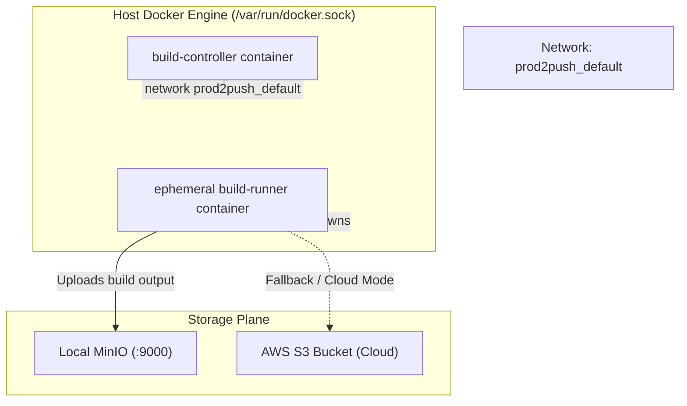

# Journey Log: Phase 1 — Docker in Docker with AWS

- **Date:** 2026-08-26
- **Author:** Akshit Bhandari
- **Branch:** `main`
- **GitHub Commit:** [`d2b560b`](https://github.com/AkshitBhandariCodes/Vercel-pro/commit/d2b560bb76da0d2c93017ad2f68b368314d3e9e6) — *Phase 1 - Docker in Docker with AWS*
- **Milestone / Phase:** Phase 14 / Container Isolation & Cloud Storage
- **Status:** Completed

---

## 1. What Was Built & Accomplished

- **Component / Service:** `services/build-controller`, `services/build-runner`, `docker-compose.yml`, and AWS S3 integration.
- **Core Changes:**
  - Configured `build-controller` to run inside Docker while executing dynamic `docker run` commands (Docker-out-of-Docker / DinD socket sharing via `/var/run/docker.sock`).
  - Added support for AWS S3 credentials alongside MinIO for dual local-and-cloud asset deployment.
  - Standardized environment variables for seamless local containerized development and cloud production parity.
- **Files Modified / Added:**
  - `docker-compose.yml`
  - `services/build-controller/Dockerfile`
  - `services/build-controller/src/index.ts`
  - `services/build-runner/src/index.ts`

---

## 2. Twists, Turns & Challenges Faced

### Challenge 1: Docker Socket Permissions in Container
- **Symptom / Error:**
  ```text
  Error: connect EACCES /var/run/docker.sock
  build-controller failed to spawn build-runner container
  ```
- **Root Cause Analysis:**
  The `build-controller` container was running as a non-root user for security best practices. However, the mounted `/var/run/docker.sock` from the host system was owned by root/docker group, causing permission denied errors when the controller attempted to invoke the Docker API.

### Challenge 2: Network Bridging Between Runner & MinIO/S3
- **Symptom:**
  Build runner spawned via host docker daemon could not resolve `minio:9000` because dynamic `docker run` commands default to the bridge network instead of the compose network `prod2push_default`.

---

## 3. Mitigation Strategies & Resolutions

- **Attempted Fixes (Failed / Suboptimal):**
  1. *Attempt 1:* Hardcoding host IP (`172.17.0.1`) — fragile across Windows Docker Desktop and Linux hosts.
  2. *Attempt 2:* Running entire controller as root without constraints — security hazard.
- **Winning Solution:**
  1. Set appropriate Docker group GID mapping or privileged flag for the controller container to interact with `/var/run/docker.sock`.
  2. Explicitly passed `--network prod2push_default` to dynamically created runner containers so they share the DNS namespace with PostgreSQL, Redis, and MinIO.
  3. Added environment fallback to AWS S3 when cloud environment variables (`AWS_ACCESS_KEY_ID`, `AWS_SECRET_ACCESS_KEY`, `AWS_REGION`) are supplied.
- **Takeaway / Key Insight:**
  > [!TIP]
  > When an orchestration container spawns peer containers via the host Docker daemon, always attach the peer container to the same network bridge using `--network <network_name>`, otherwise internal service DNS resolution fails.

---

## 4. Architecture & Design Impact



- **Associated ADR:** [ADR-001: Dynamic Ephemeral Build Runners vs Long-Running Worker Pool](../adr/001-dynamic-dind-vs-fixed-worker-pool.md)

---

## 5. Verification & Proof of Work

- **Test Command:**
  ```powershell
  docker compose up -d
  docker compose ps
  ```
- **Observed Result:**
  All services (`postgres`, `redis`, `minio`, `project-service`, `build-controller`, `routing-service`, `api-gateway`, `web`) healthy. Build jobs received on Redis successfully spawned temporary `build-runner` containers, uploaded output to MinIO/S3, and exited cleanly.

---

## 6. Next Steps & Trajectory
- [x] Docker in Docker setup verified.
- [ ] Implement Kubernetes Pod Job executor (`services/build-controller/src/k8s-executor.ts`).
- [ ] Connect Minikube cluster runner for Phase 16-17.
