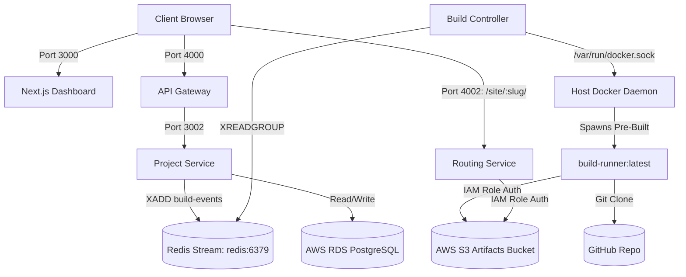

# Journey Log: Fixing Redis Stream Networking, Build-Runner Prebuild, and Global Deployment Routing

- **Date:** 2026-10-02
- **Author:** AkshitBhandariCodes
- **Branch:** `main`
- **GitHub Commit:** [`4d6e86e`](https://github.com/AkshitBhandariCodes/Vercel-pro/commit/4d6e86eb4e2e67f09592843f378b36f687b370f0) — *fix(prod): resolve redis stream connectivity, build-runner prebuild, and dynamic global deployment routing*
- **Milestone / Phase:** Cloud Microservices Production Hardening & Global Access
- **Status:** Completed

---

## 1. What Was Built & Accomplished

During our live test on AWS EC2, the microservices were running in Docker, but three critical production discrepancies emerged between local emulation and cloud execution:
1. **Redis Stream Connectivity in Bridge Network:** Microservices inside Docker containers attempted to connect to `localhost:6379`, failing to reach the `redis` container.
2. **Build-Runner Ephemeral Image Availability:** The build controller failed to spawn build jobs because `prod2push/build-runner:latest` was never built on the host Docker daemon.
3. **Global Deployment URL Resolution:** Deployments generated `http://<slug>.localhost:4002/` URLs that were inaccessible over the internet on cloud public IPs.

### Core Changes:
- **`docker-compose.prod.yml`:**
  - Injected `REDIS_URL: redis://redis:6379` into all application microservices (`web`, `api-gateway`, `project-service`, `routing-service`, `build-controller`).
  - Added a `build-runner` pre-build target so `prod2push/build-runner:latest` is built and cached on the host Docker daemon during `docker compose up -d --build`.
- **`services/build-runner/src/runner.ts` & `services/build-controller/src/build.ts`:**
  - Removed strict requirement for static `S3_ACCESS_KEY_ID` and `S3_ENDPOINT`. When running on EC2, the AWS SDK automatically inherits credentials from the IAM instance profile (`push2prod-dev-ec2-role`) and connects to AWS S3.
  - Adjusted Docker build container resource limits (`--memory 800m`, `--memory-swap 2000m`) to safely leverage EC2 swap memory without triggering kernel OOM kills.
- **`services/routing-service/src/index.ts` & `apps/web`:**
  - Updated `apps/web/src/app/projects/[id]/page.tsx` with dynamic `getLiveUrl(slug)`: on `localhost` it uses `.localhost:4002`, and on EC2/Cloud IPs it automatically renders `http://<HOST_IP>:4002/site/<slug>/`.
  - Added a direct **"Visit ↗"** button on every `READY` deployment row in the dashboard.
  - Enhanced `routing-service` middleware to support wildcard subdomains across `.localhost` and `.nip.io`.

---

## 2. Twists, Turns & Challenges Faced

### Challenge 1: Redis Stream Disconnected & Health Check Reporting Unhealthy
- **Symptom / Error:**
  - Health check endpoint `/api/health` returned:
    ```json
    { "status": "unhealthy", "dependencies": { "postgres": "connected", "redis": "disconnected" } }
    ```
- **Root Cause Analysis:**
  - In local development, services run directly on the host machine using `localhost:6379`. In `docker-compose.prod.yml`, each container has its own network namespace. `localhost:6379` connected to the container itself, where no Redis daemon was listening. Redis lived in the sibling `redis` container on the `prod2push-internal` bridge network.

### Challenge 2: Builds Failing Immediately (Exit Code 125 / Pull Denied)
- **Symptom / Error:**
  - When triggering a build from the dashboard, deployment status failed with error:
    ```text
    Unable to find image 'prod2push/build-runner:latest' locally
    docker: Error response from daemon: pull access denied for prod2push/build-runner
    ```
- **Root Cause Analysis:**
  - Unlike web or api-gateway, `build-runner` is not a persistent service—it is an ephemeral job container spawned dynamically by `build-controller` via `/var/run/docker.sock`. Because `build-runner` was omitted from `docker-compose.prod.yml`, running `docker compose up -d --build` never built `prod2push/build-runner:latest`. When the Docker daemon couldn't find the image locally, it attempted to pull it from Docker Hub and crashed.
  - Furthermore, `runner.ts` crashed if static `S3_ACCESS_KEY_ID` was unset, preventing seamless use of AWS IAM Instance Profiles.

### Challenge 3: Inaccessible Deployment URLs (`localhost:4002`)
- **Symptom:**
  - Navigating to `http://<EC2-PUBLIC-IP>:3000`, the project Live URL button pointed to `http://<slug>.localhost:4002/`. Clicking it attempted to open `localhost` on the user's laptop rather than the cloud server.
- **Root Cause Analysis:**
  - DNS does not allow subdomains on raw IP addresses (e.g. `mysite.98.93.56.187` is invalid DNS syntax).
  - The URL was hardcoded to `localhost:4002`.

---

## 3. Mitigation Strategies & Resolutions

- **Attempted Fixes (Suboptimal):**
  1. *Hardcoding public IP in build artifacts:* Fails whenever EC2 instance is stopped and receives a new dynamic public IP upon restart.
- **Winning Solutions:**
  1. **Container Networking:** Configured `REDIS_URL: redis://redis:6379` inside `docker-compose.prod.yml`, enabling seamless communication across `prod2push-internal`.
  2. **Pre-Build Service Target:** Added `build-runner` service in `docker-compose.prod.yml` with `restart: "no"`. When `docker compose up -d --build` runs, it compiles and tags `prod2push/build-runner:latest` directly into the EC2 host Docker daemon.
  3. **IAM Credential Decoupling:** S3 client setup in `@push2prod/config`, `build-runner`, `build-controller`, and `routing-service` now detects whether static keys exist. If absent, it automatically delegates to AWS IAM roles.
  4. **Dynamic Global Routing:** In `apps/web`, client-side host detection routes to `http://${window.location.hostname}:4002/site/${project.slug}/`. Anyone worldwide can access deployments immediately using the EC2 public IP without requiring custom DNS.

---

## 4. Architecture & Design Impact



---

## 5. Verification & Proof of Work

- **TypeScript Compilation:**
  - `@push2prod/config`: `tsc` exited with code 0.
  - `@push2prod/routing-service`: `tsc` exited with code 0.
  - `@push2prod/build-runner`: `tsc` exited with code 0.
  - `@push2prod/build-controller`: `tsc` exited with code 0.
  - `web` (Next.js Turbopack build): `next build` compiled all 9 static and dynamic routes cleanly with exit code 0.
- **Git Commit:** Committed and pushed directly to `main` at [`4d6e86e`](https://github.com/AkshitBhandariCodes/Vercel-pro/commit/4d6e86eb4e2e67f09592843f378b36f687b370f0).

---

## 6. Next Steps & Trajectory

- [ ] Restart EC2 instance and RDS database in AWS Console.
- [ ] Pull latest changes (`git pull`) on EC2.
- [ ] Run `docker compose -f docker-compose.prod.yml up -d --build` on EC2.
- [ ] Verify green health status (`/health`) and trigger an end-to-end build test to verify S3 upload and live URL rendering at `http://<EC2_IP>:4002/site/<slug>/`.
