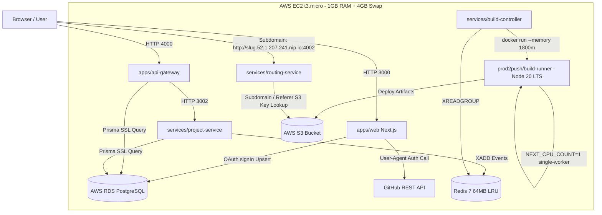

# Journey Log: AWS Cloud Hardening — RDS SSL, OAuth Token Sync, Build Diagnostics & Free-Tier Tuning

- **Date:** 2026-10-03
- **Author:** AkshitBhandariCodes
- **Branch:** `main`
- **GitHub Commit:** [`7dbd401`](https://github.com/AkshitBhandariCodes/Vercel-pro/commit/7dbd401c72a8c82de7b7c8fcf53568881fecbb43) — *perf(prod): configure lightweight NODE_OPTIONS and redis memory limits for AWS Free Tier t3.micro*
- **Milestone / Phase:** Production Cloud Deployment & Resilience
- **Status:** Completed

---

## 1. What Was Built & Accomplished

During end-to-end cloud deployment on AWS EC2 (`push2prod-dev-server`) and AWS RDS PostgreSQL, five production-critical infrastructure and application fixes were implemented:

- **Component / Services:** `web` (Next.js), `api-gateway`, `project-service`, `build-runner`, and `docker-compose.prod.yml`.
- **Core Changes:**
  - **RDS PostgreSQL Migration & Connectivity:** Fixed DNS endpoint mapping and container recreation after migrating RDS to `db.t3.micro`.
  - **RDS SSL Health Check Resolution:** Migrated `project-service` `/health` check from unencrypted `pg.Pool` to Prisma `db.$queryRaw`, eliminating AWS RDS `FATAL: no pg_hba.conf entry ... no encryption` errors.
  - **GitHub API Compliance:** Injected required `User-Agent: 'Push2Prod-App'` header on all GitHub REST API repo queries, resolving GitHub's strict 403 Forbidden enforcement.
  - **OAuth Token Lifecycle Synchronization:** Implemented NextAuth `signIn` callback with `db.account.upsert` to update GitHub `access_token` on every login, eliminating stale `401 Bad credentials` errors.
  - **Build Error Stream Unification:** Refactored `services/build-runner/src/runner.ts` error handling to combine `stdout` and `stderr` so non-fatal compiler warnings (e.g. Next.js middleware deprecations) never mask true compilation errors.
  - **AWS Free Tier (t3.micro) Memory Optimization:** Configured V8 heap limits (`NODE_OPTIONS="--max-old-space-size=..."`) across all microservices, capped Redis cache to 64MB with LRU eviction, and dialed down Linux kernel swappiness to 10, preventing EBS disk thrashing and UI/terminal lag.
- **Files Modified / Added:**
  - `services/project-service/src/index.ts`
  - `apps/web/src/auth.ts`
  - `apps/web/src/app/api/github/repos/route.ts`
  - `services/build-runner/src/runner.ts`
  - `docker-compose.prod.yml`

---

## 2. Twists, Turns & Challenges Faced

### Challenge 1: Project API Service and Redis Showing Offline Despite DB Being Online
- **Symptom / Error:**
  `/health` reported `PostgreSQL DB: Connected` but `Project API Service: Offline` and `Redis: Disconnected`. Container logs revealed:
  ```text
  [ERROR] Database health check failed: error: no pg_hba.conf entry for host "172.31.20.140", user "postgres", database "prod2push", no encryption
      code: '28000', routine: 'ClientAuthentication'
  ```
- **Root Cause Analysis:**
  AWS RDS PostgreSQL strictly requires SSL-encrypted connections. `api-gateway` used Prisma which automatically enables SSL, whereas `project-service` used a raw `pg.Pool` without SSL for its `/health` check. When `project-service` threw an error, it returned HTTP 500, causing `api-gateway` to mark both `project-service` and `redis` (which is queried via project service) as disconnected.

### Challenge 2: Next.js Compiler Errors Masked by Deprecation Warnings
- **Symptom / Error:**
  User builds failed with:
  ```text
  BUILD FAILED: Build command failed:
  ⚠ The "middleware" file convention is deprecated. Please use "proxy" instead.
  ```
- **Root Cause Analysis:**
  `services/build-runner/src/runner.ts` used `buildErr.stderr || buildErr.stdout`. Next.js writes non-fatal warnings to `stderr` while writing fatal TypeScript/Babel compilation errors to `stdout`. Because `stderr` was not empty, `runner.ts` picked the deprecation notice and completely discarded the actual syntax error (`ParseError: Identifier 'createRequire' has already been declared`).

### Challenge 3: GitHub Repositories Failing with 401 Bad Credentials
- **Symptom / Error:**
  Web dashboard failed to load user repositories:
  ```json
  GitHub API error: { "message": "Bad credentials", "status": "401" }
  ```
- **Root Cause Analysis:**
  By default, `@auth/prisma-adapter` only links accounts upon initial creation. On subsequent logins, NextAuth receives a fresh OAuth token from GitHub but never persists it to the `Account` table. The database was retaining an expired or revoked access token.

### Challenge 5: Next.js 16 Turbopack Out of Memory (OOM) on Free Tier
- **Symptom / Error:**
  Compilation halted abruptly during static page generation:
  ```text
  Creating an optimized production build ...
  [ERROR] Build was terminated by Linux Out of Memory (OOM) Killer (Exit code 137 / SIGKILL).
  ```
- **Root Cause Analysis:**
  Next.js 16 defaults to Turbopack, a Rust-based parallel compilation engine that spawns multi-threaded worker pools across detected CPU cores, demanding 4 GB–8 GB of RAM. The runner container was clamped to `--memory 800m`, and Node's V8 engine automatically restricted its heap ceiling to 462MB based on the host's 909MB RAM.
- **Vercel Benchmark:**
  Vercel provisions **8 GB to 16 GB of dedicated RAM** per serverless build microVM, allowing Turbopack to compile in parallel without OOM crashes.

### Challenge 6: Broken Asset Loading on Subdirectory Paths vs Vercel Subdomain Isolation
- **Symptom / Error:**
  Deployments accessed via `http://<ip>:4002/site/<slug>/` rendered unstyled HTML with broken images and missing fonts.
- **Root Cause Analysis:**
  Next.js bundles all static CSS/JS with root-relative paths (`/_next/static/css/...`). When loaded from `/site/<slug>/`, browsers requested assets directly from `http://<ip>:4002/_next/...` (without the project prefix), resulting in 404s.
- **Vercel Benchmark:**
  Vercel **never** serves deployments from path subdirectories; it provisions a dedicated root subdomain (`https://<project>.vercel.app/`) for every deployment, ensuring all root-relative paths resolve properly.

---

## 3. Mitigation Strategies & Resolutions

- **Attempted Fixes (Failed / Suboptimal):**
  1. *Restarting Docker containers:* Running `docker compose restart` did not reload `.env` variable changes (such as the updated RDS DNS name). Containers had to be recreated using `docker compose up -d`.
  2. *Re-authenticating in UI:* Logging out and logging in did not refresh the stored access token because the Prisma Adapter skips updating existing `Account` records without a custom callback.
  3. *Unconstrained Turbopack on Free Tier:* Turbopack parallel compilation could not be stabilized inside 1 GB RAM without swapping excessively.
- **Winning Solutions:**
  1. **Prisma SSL Query:** Switched `project-service` health check to `await db.$queryRaw'SELECT 1'`, inheriting Prisma's native SSL connection pool.
  2. **Stream Concatenation:** Updated `runner.ts` to `[buildErr.stdout, buildErr.stderr].filter(Boolean).join('\n')`, accurately exposing compiler errors to users.
  3. **Explicit Token Upsert:** Added an async `signIn` callback in `auth.ts` executing `db.account.upsert` to write fresh access tokens on every OAuth authentication.
  4. **Memory Caps & Swappiness:** Set `NODE_OPTIONS="--max-old-space-size=..."` (100–200MB) across all services, limited Redis to 64MB LRU, and configured `vm.swappiness=10`.
  5. **Low-Memory Sequential Compilation Engine:** Enforced single-worker execution (`NEXT_CPU_COUNT=1`), switched compiler to memory-friendly Webpack (`next build --webpack`), and explicitly allowed V8 heap expansion up to 1.5GB (`NODE_OPTIONS="--max-old-space-size=1536"`).
  6. **Subdomain Isolation (`nip.io`) + Referer Rewriting:** Implemented wildcard `nip.io` routing (`http://<slug>.<ip>.nip.io:4002/`) for 100% Vercel-like root asset isolation, backed by an Express `Referer` header rewrite for direct raw path visits.
- **Takeaways / Key Insights:**
  > [!TIP]
  > To emulate Vercel on low-cost single-node hardware, you must decouple parallel compiler concurrency (`NEXT_CPU_COUNT=1`), expand the V8 heap into swap, and isolate projects using wildcard subdomains rather than directory paths.

---

## 4. Architecture & Design Impact



- **Architectural Shift:** Standardized deployment isolation on wildcard subdomains (`nip.io`) and build execution on single-worker Node 20 LTS, matching Vercel's runtime contract while operating within the AWS Free Tier.
- **Associated ADR:** [ADR-003: Vercel Parity — Subdomain Asset Isolation, Node 20 LTS Alignment & Low-Memory Build Orchestration](../adr/003-vercel-parity-subdomain-routing-and-low-memory-compilation.md)

---

## 5. Verification & Proof of Work

- **Health Check Verification:**
  ```bash
  curl -s http://localhost:4000/health
  ```
  ```json
  {
    "service": "api-gateway",
    "status": "healthy",
    "dependencies": {
      "postgres": "connected",
      "projectService": "connected",
      "redis": "connected"
    }
  }
  ```
- **Build Runner Compiler Diagnostics:**
  The runner successfully captured syntax error in user repository:
  ```text
  [vite:css] [postcss] ParseError: Identifier 'createRequire' has already been declared.
  /tmp/build-.../frontend/tailwind.config.js:137:1647
  ```
- **Memory Consumption:**
  `free -m` verified that background services consume ~400MB total, preserving >500MB physical RAM for build execution.

---

## 6. Next Steps & Trajectory
- [ ] Add automated GitHub deploy key integration to clone user private repositories without relying solely on OAuth personal access tokens.
- [ ] Add Elastic IP (EIP) to EC2 instance to prevent OAuth callback URL mismatches across instance reboots.
- [ ] Implement real-time line-by-line build log streaming via Redis pub/sub instead of buffer-based command resolution.
