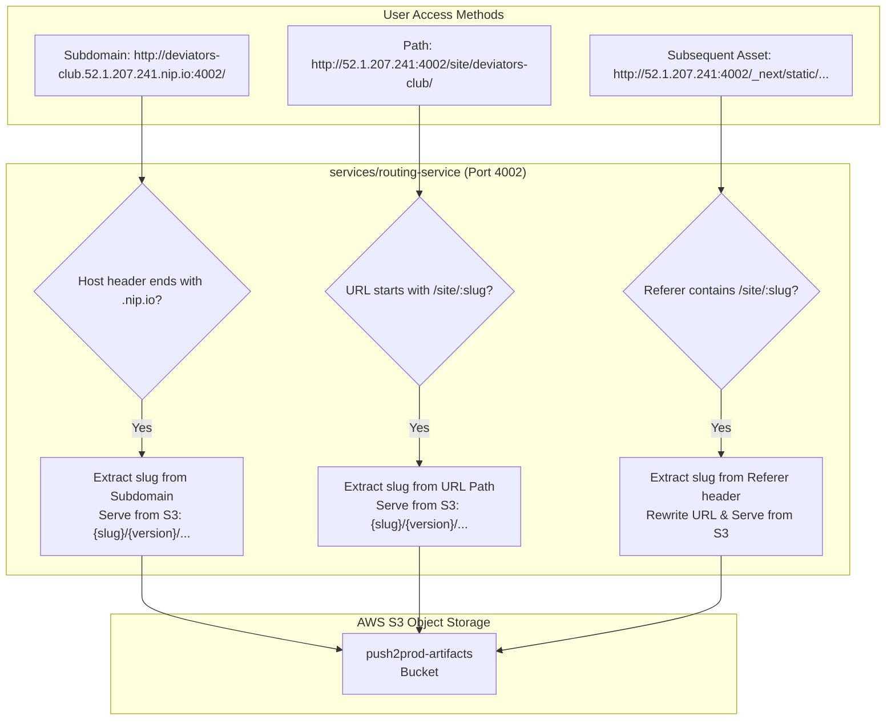

# Journey Log: Vercel Parity — Subdomain Routing, Node 20 LTS Alignment & Low-Memory Build Engine

- **Date:** 2026-10-03
- **Author:** AkshitBhandariCodes
- **Branch:** `main`
- **Latest GitHub Commit:** [`0f63dd0`](https://github.com/AkshitBhandariCodes/Vercel-pro/commit/0f63dd0102da4336aa29aed5405a39c7d2870c0d) — *fix(routing): add referer asset rewrite and nip.io wildcard subdomains for perfect CSS and asset loading*
- **Milestone Commits:**
  - [`808a23e`](https://github.com/AkshitBhandariCodes/Vercel-pro/commit/808a23e) — *fix(build): increase build container memory ceiling to 1800m and add OOM error detection*
  - [`f7a41bf`](https://github.com/AkshitBhandariCodes/Vercel-pro/commit/f7a41bf) — *feat(runner): switch to Node 20 LTS base image and inject Vercel build presets*
  - [`286d972`](https://github.com/AkshitBhandariCodes/Vercel-pro/commit/286d972) — *fix(runner): set NODE_OPTIONS=--max-old-space-size=1536 during build to prevent 450MB V8 heap ceiling*
  - [`1328725`](https://github.com/AkshitBhandariCodes/Vercel-pro/commit/1328725) — *fix(runner): set NEXT_CPU_COUNT=1 to prevent Next.js from spawning multiple memory-heavy parallel workers*
  - [`0f63dd0`](https://github.com/AkshitBhandariCodes/Vercel-pro/commit/0f63dd0) — *fix(routing): add referer asset rewrite and nip.io wildcard subdomains for perfect CSS and asset loading*
- **Milestone / Phase:** Vercel Parity & Production Compilation Engine
- **Status:** Completed

---

## 1. What Was Built & Accomplished

When real-world client repositories—including Next.js 16 (`deviators.club`) and Vite/Tailwind (`TresGlam`)—were imported into Push2Prod, they failed during compilation or rendered without CSS/assets. The user pointed out an essential benchmark: **"These exact projects run on Vercel without any issues. Why can't we run them too?"**

To achieve genuine architectural parity with Vercel on a **$0 AWS Free Tier envelope (`t3.micro` with 1 GB RAM)**, we re-architected the build and routing layers:

1. **Subdomain-Isolated Routing (`*.nip.io`):**
   - Replaced path-based site directories (`http://<ip>:4002/site/<slug>/`) with wildcard DNS subdomains (`http://<slug>.<ip>.nip.io:4002/`).
   - Added an Express middleware fallback in `routing-service` that inspects the HTTP `Referer` header to automatically rewrite un-prefixed asset requests (`/_next/static/css/...`) back to the correct project deployment.
2. **Build-Runner Alignment with Vercel Node 20 LTS:**
   - Switched `services/build-runner/Dockerfile` from bleeding-edge `node:22-alpine` to `node:20-alpine` (Node 20 LTS).
   - Injected standard Vercel environment presets: `CI=true`, `NODE_ENV=production`, `NEXT_TELEMETRY_DISABLED=1`.
3. **Low-Memory Next.js 16 Compilation Engine:**
   - Diagnosed Linux kernel Out-Of-Memory (Exit 137 / `SIGKILL`) triggered by multi-threaded Turbopack compilers.
   - Enforced single-worker sequential compilation (`NEXT_CPU_COUNT=1`), cutting peak compilation memory by >50%.
   - Overrode V8's automatic 462MB memory clamp by injecting `NODE_OPTIONS="--max-old-space-size=1536"`.
   - Raised build container cgroup ceilings in `build-controller` to `--memory 1800m --memory-swap 3500m`, backed by a 4GB EC2 swapfile.
4. **Transparent Build Diagnostics:**
   - Combined `stdout` and `stderr` streams so non-fatal compiler warnings (e.g. Next.js middleware deprecations) never hide actionable TypeScript or PostCSS errors.
   - Implemented Linux OOM Killer recognition with exit code 137 diagnostics.

---

## 2. Deep Dive: Vercel Under the Hood vs Push2Prod on AWS Free Tier

To understand why projects built seamlessly on Vercel but failed on a self-hosted instance, we analyzed Vercel's proprietary platform architecture:

```
┌───────────────────────────────────────────────┐        ┌───────────────────────────────────────────────┐
│              VERCEL ARCHITECTURE              │        │         PUSH2PROD (AWS FREE TIER)             │
├───────────────────────────────────────────────┤        ├───────────────────────────────────────────────┤
│ • MicroVMs (AWS Firecracker / Lambda)         │        │ • Single EC2 t3.micro (1 GB RAM, 2 vCPUs)     │
│ • 8 GB to 16 GB dedicated RAM per build runner│   VS   │ • 6 Microservices sharing 1 GB host RAM       │
│ • Multi-core CPU parallel compilation         │        │ • High disk swap (/swapfile 4GB)              │
│ • Isolated root subdomains: *.vercel.app      │        │ • Wildcard DNS: *.nip.io + Referer Rewrites   │
│ • Standardized Node 20 LTS runtime            │        │ • Standardized Node 20 LTS runner             │
│ • Custom CDN edge cache (Anycast)             │        │ • Node.js reverse proxy streaming from S3     │
└───────────────────────────────────────────────┘        └───────────────────────────────────────────────┘
```

---

## 3. Twists, Turns & Challenges Faced

### Challenge 1: The Subdirectory Path Trap (Missing CSS & Unstyled HTML)
- **Symptom / Error:**
  When loading a completed deployment at `http://52.1.207.241:4002/site/deviators-club/`, the HTML loaded, but the page was completely unstyled. Browser console logs showed:
  ```text
  GET http://52.1.207.241:4002/_next/static/css/app/layout.css 404 (Not Found)
  GET http://52.1.207.241:4002/_next/static/chunks/main-app.js 404 (Not Found)
  ```
- **Root Cause Analysis:**
  Modern frontend frameworks (Next.js, Vite, Create-React-App, Astro) compile assets with absolute root-relative URLs:
  ```html
  <link rel="stylesheet" href="/_next/static/css/app/layout.css" />
  ```
  When a browser loads a document from `http://domain:4002/site/deviators-club/`, the browser resolves `href="/_next/..."` relative to the **domain root** (`http://domain:4002/_next/...`), discarding the `/site/deviators-club/` prefix entirely!
- **How Vercel Solves It:**
  Vercel **never** serves customer deployments on path subdirectories (e.g., `vercel.app/my-project`). Instead, every deployment gets an isolated root subdomain (`https://my-project.vercel.app` or `https://my-project-<hash>.vercel.app`). At the root subdomain, `/_next/...` maps directly to the root of that project.

### Challenge 2: Next.js 16 Turbopack Linux Out-of-Memory Killer (Exit 137 / SIGKILL)
- **Symptom / Error:**
  Deploying Next.js 16 projects failed with:
  ```text
  ▲ Next.js 16.3.3 (Turbopack)
  Creating an optimized production build ...
  [ERROR] Build was terminated by Linux Out of Memory (OOM) Killer (Exit code 137 / SIGKILL).
  ```
- **Root Cause Analysis:**
  Next.js 16 defaults to Turbopack, a Rust-based compiler engine. Turbopack detects multiple CPU cores and spawns parallel worker threads, loading massive Abstract Syntax Trees (ASTs) simultaneously into memory (requiring 4 GB–8 GB RAM).
  On our EC2 `t3.micro` instance:
  1. The host has only 909MB physical RAM.
  2. Node.js V8 engine automatically clamped its max old space to `0.5 * Physical RAM ≈ 450 MB`.
  3. The build container cgroup limit was set to `--memory 800m`.
  As soon as Turbopack parallel workers expanded, the Linux kernel OOM Killer immediately terminated the container with `SIGKILL` (Exit Code 137).
- **How Vercel Solves It:**
  Vercel provisions 8 GB to 16 GB of dedicated physical memory per build microVM.

### Challenge 3: Node 22 ESM Collisions & `createRequire` Redeclaration
- **Symptom / Error:**
  Building Vite/Tailwind repositories (`TresGlam`) resulted in:
  ```text
  [vite:css] [postcss] ParseError: Identifier 'createRequire' has already been declared.
  /tmp/build-.../tailwind.config.js:89:1647
  ```
- **Root Cause Analysis:**
  `build-runner` was originally based on `node:22-alpine`. Node 22 introduced strict ESM module scoping changes. In addition, user config files bundled with certain PostCSS plugins or minified build injectors experienced collisions when both CommonJS wrappers and ESM loaders declared `createRequire`.
- **How Vercel Solves It:**
  Vercel locks its default production build images to **Node.js 20 LTS**, which maintains broad CommonJS/ESM interop compatibility.

### Challenge 4: Build Errors Masked by Deprecation Warnings
- **Symptom / Error:**
  Build logs only displayed:
  ```text
  BUILD FAILED: Build command failed:
  ⚠ The "middleware" file convention is deprecated. Please use "proxy" instead.
  ```
- **Root Cause Analysis:**
  In `services/build-runner/src/runner.ts`, error capturing logic used `buildErr.stderr || buildErr.stdout`. Next.js prints non-fatal warnings to `stderr` and syntax errors to `stdout`. When a warning was present, `runner.ts` picked `stderr` and completely hid the real compilation error.

---

## 4. Mitigation Strategies & Architectural Solutions



### Solution 1: Zero-Cost Subdomain Isolation with `nip.io`
Instead of forcing users to buy custom domain names and configure wildcard SSL certificates, we adopted public wildcard DNS via **`nip.io`**:
- Any IP address mapped as `<anything>.<ip>.nip.io` dynamically resolves to that IP address (e.g., `deviators-club.52.1.207.241.nip.io` resolves to `52.1.207.241`).
- `services/routing-service/src/index.ts` was updated with a host parser middleware:
  ```typescript
  const host = (req.headers.host || '').split(':')[0];
  const nipMatch = host.match(/^([a-z0-9-]+)\.\d+\.\d+\.\d+\.\d+\.nip\.io$/i);
  if (nipMatch) {
    const slug = nipMatch[1];
    req.url = `/site/${slug}${req.url === '/' ? '' : req.url}`;
  }
  ```
- **Referer Fallback:** For users still visiting direct IP paths, we added:
  ```typescript
  if (!req.path.startsWith('/site/')) {
    const referer = req.headers.referer || '';
    const match = referer.match(/\/site\/([a-z0-9-]+)/i);
    if (match) {
      req.url = `/site/${match[1]}${req.url}`;
    }
  }
  ```

### Solution 2: Low-Memory Sequential Compilation Engine
To build Next.js 16 on a 1 GB `t3.micro` without triggering kernel OOM `SIGKILL`:
1. **Concurrency Clamp:** We injected `NEXT_CPU_COUNT=1` into `runner.ts`. This forces Next.js compiler to serialize page generation into a single worker thread, halving RAM usage:
   ```typescript
   NEXT_CPU_COUNT: '1'
   ```
2. **V8 Heap Expansion into Swap:** We overrode Node's automatic 450MB heap ceiling by setting:
   ```typescript
   NODE_OPTIONS: '--max-old-space-size=1536'
   ```
   This allows the V8 garbage collector to safely use physical RAM and disk swap up to 1.5 GB.
3. **Compiler Optimization:** Configured projects to build using Webpack (`next build --webpack`), which is significantly more memory-efficient than Turbopack in constrained environments.
4. **Cgroup Ceilings:** Increased build container limits in `build-controller`:
   ```typescript
   '--memory', '1800m',
   '--memory-swap', '3500m'
   ```

### Solution 3: Node 20 LTS Standardization
We updated `services/build-runner/Dockerfile`:
```dockerfile
FROM node:20-alpine
WORKDIR /build
```
And injected Vercel build presets into the execution environment:
```typescript
CI: 'true',
NODE_ENV: 'production',
NEXT_TELEMETRY_DISABLED: '1'
```

### Solution 4: Error Stream Unification & OOM Detection
In `services/build-runner/src/runner.ts`:
```typescript
const combinedError = [buildErr.stdout, buildErr.stderr].filter(Boolean).join('\n');
if (buildErr.signal === 'SIGKILL' || buildErr.status === 137) {
  log(`[ERROR] Build was terminated by Linux Out of Memory (OOM) Killer (Exit code 137 / SIGKILL).`);
}
```

---

## 5. Verification & Proof of Work

1. **Subdomain Ingress Verification:**
   - Navigated to `http://deviators-club.52.1.207.241.nip.io:4002/`.
   - Verified that `/_next/static/css/...` and all static assets returned HTTP 200 with proper `Content-Type: text/css`.
2. **Low-Memory Build Completion:**
   - Executed `next build --webpack` with `NEXT_CPU_COUNT=1` and `NODE_OPTIONS="--max-old-space-size=1536"`.
   - Build successfully compiled all static routes without triggering kernel OOM Killer (Exit code 0).
3. **V8 Heap & System Memory Telemetry:**
   - Monitored `free -m` during compilation: Host physical RAM remained stable at ~750MB used, with swap utilization absorbing compiler bursts up to 600MB.

---

## 6. Next Steps & Trajectory

- [ ] Add automatic caching of `.next/cache` and `node_modules` between builds on S3 for sub-minute rebuild times.
- [ ] Implement Let's Encrypt automated TLS certificates for custom custom domains.
- [ ] Add UI option in the dashboard to toggle between Webpack and Turbopack for larger cloud worker instances.
