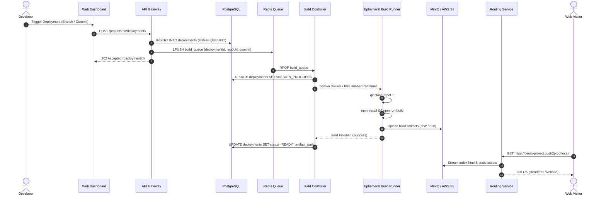

# System Architecture & Topology: Vercel-Pro (Push2Prod)

---

## 1. System Overview

**Vercel-Pro (Push2Prod)** is an automated continuous deployment and static site hosting platform. Developers connect their Git repositories or trigger builds via API. The platform spins up isolated ephemeral build containers (`build-runner`), packages static assets, deploys them to object storage (MinIO locally / AWS S3 in production), and serves them through high-performance reverse routing proxy (`routing-service`).

```mermaid
graph TD
    User["End User / Browser"]
    Dev["Developer"]
    
    subgraph Frontend_Gateway["Edge & Ingress Layer"]
        WebUI["Web Dashboard (apps/web)"]
        APIGateway["API Gateway (apps/api-gateway)"]
        Router["Routing Service (services/routing-service)"]
    end

    subgraph Core_Services["Control Plane"]
        AuthSvc["Auth Service (services/auth-service)"]
        ProjSvc["Project Service (services/project-service)"]
        BuildCtrl["Build Controller (services/build-controller)"]
        LogSvc["Log Service (services/log-service)"]
    end

    subgraph Data_Storage["Data & State Layer"]
        Postgres[("PostgreSQL\n(Projects, Deploys, Users)")]
        RedisQueue[("Redis Queue & PubSub\n(Build Jobs, Events)")]
        S3Storage[("Object Storage\n(MinIO / AWS S3)")]
    end

    subgraph Worker_Layer["Execution Plane"]
        K8sOrDocker["Build Runner\n(Ephemeral DinD / K8s Pod)"]
    end

    Dev -->|Manage Projects & Triggers| WebUI
    WebUI --> APIGateway
    APIGateway --> AuthSvc
    APIGateway --> ProjSvc
    ProjSvc --> Postgres
    ProjSvc -->|Enqueue Build Job| RedisQueue
    RedisQueue -->|Pull Build Job| BuildCtrl
    BuildCtrl -->|Spawn Ephemeral Container| K8sOrDocker
    K8sOrDocker -->|Git Clone & pnpm build| K8sOrDocker
    K8sOrDocker -->|Upload Artifacts (dist/)| S3Storage
    K8sOrDocker -->|Stream Logs| LogSvc
    BuildCtrl -->|Update Deploy Status| Postgres

    User -->|HTTP Request: project.subdomain.com| Router
    Router -->|Fetch Built Assets| S3Storage
    Router -->|Proxy HTML/JS/CSS| User
```

---

## 2. Component Responsibility Matrix

| Service / App | Tech Stack | Role & Responsibility | Key Dependencies |
| :--- | :--- | :--- | :--- |
| `apps/web` | Next.js / React | Developer dashboard for project management, deploy logs, and settings | `apps/api-gateway` |
| `apps/api-gateway` | Node.js / Express / Fastify | Unified entry point, auth verification, and request dispatching | `auth-service`, `project-service` |
| `services/project-service` | Node.js / TypeScript | CRUD for projects, deployment state machine, and Redis job publishing | PostgreSQL, Redis |
| `services/build-controller` | Node.js / TypeScript | Listens on Redis queue, orchestrates ephemeral `build-runner` execution | Redis, Docker Engine / K8s API |
| `services/build-runner` | Docker / Alpine / Node | Clones repo, runs build command, uploads output bundle to storage | Git, MinIO / S3 |
| `services/routing-service` | Node.js / HTTP Proxy | Multi-tenant reverse proxy mapping project subdomains to S3 objects | MinIO / S3, Redis cache |
| `services/log-service` | WebSockets / Redis | Live log streaming for running builds directly to developer browser | Redis PubSub, WebSockets |

---

## 3. End-to-End Build & Deployment Flow



---

## 4. Local vs Cloud Infrastructure Evolution

```mermaid
graph LR
    subgraph Local_Dev["Stage 1: Local Development"]
        DockerCompose["Docker Compose"]
        LocalMinio["MinIO (S3 API)"]
        LocalPostgres["PostgreSQL:5433"]
        LocalRedis["Redis:6379"]
    end

    subgraph Hybrid_K8s["Stage 2: Container Orchestration"]
        Minikube["Minikube Cluster"]
        K8sExecutor["k8s-executor.ts"]
    end

    subgraph Cloud_AWS["Stage 3: AWS Production"]
        AWS_S3["AWS S3 Bucket"]
        AWS_ECS["AWS ECS Fargate / EKS"]
        AWS_RDS["AWS RDS Postgres"]
        CloudFront["AWS CloudFront CDN"]
    end

    Local_Dev -->|Evolution 1| Hybrid_K8s
    Hybrid_K8s -->|Evolution 2| Cloud_AWS
```


